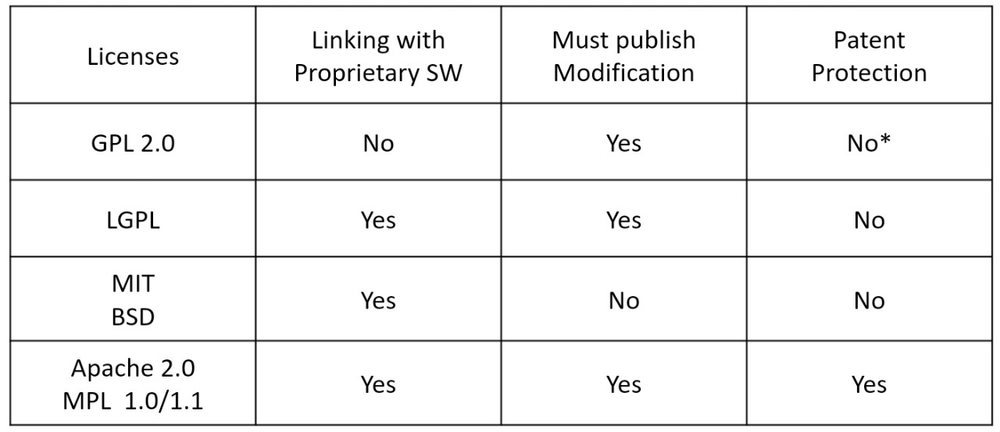

# 오픈소스소프트웨어
### 담당교수 : **최광훈**
### 수업 목표 : Basic functional programming _Haskell_
### 수업 평가 : 예습, 퀴즈, 요약 강의, 과제 + _지필고사_
### 핵심역량 : **창의**-80%, **공동체**-20%

## Introduction to Open Source Software  
[**_github_**](https://github.com/)  
**Repositories**를 이용하는 오픈소스소프트웨어  
_오픈소스소프트웨어_ 란?  
> 소프트웨어 저작권 소유자가 모든 사람에게 소스 코드를 **게시, 사용, 복사, 수정 및 배포**할 권리를 부여한 소프트웨어  

**오픈소스소프트웨어 라이센스**  

## Introduction to Version Control System
**version control system(vcs)** 가 없다면 버전관리하기 복잡하고 귀찮음  
**_VCS_** 란?  
> 이전 작업 버전으로 쉽게 돌아갈 수 있도록 시간이 지남에 따라 파일을 추적  

### VCS software
* CVS (Concurrent Version System)
* SVN (Subversion)
* Mercurial
* Darcs
* Git  

### Git에서의 명령어
* **commit**: workspace -> repository
* **fetch/pull**: repository -> workspace
* **Branch(Diffs)**: 버전 간의 차이 확인
* **Branch(Branching)**: 같은 파일을 다르게 수정 (가지치기)
* **Branch(Merging)**: 가지치기한 파일을 합치는 과정
* **Branch(Conflicts)**: Merge하는 과정에서 충돌이 발생
* **Branch(Tagging)**: 버전에 이름 붙이기

### VCS의 2가지 타입
**Centralized VCS**
> _중앙집중화된_ VCS  
하나의 repository를 많은 사용자들이 사용

**Distributed VCS**
> _분산된_ VCS  
모든 유저가 자신의 local repository를 가지고 있음

**GIT의 _Workflow_**

## GIT  
> _개발과정, 소스파일_ 등을 관리하는 도구  
개발되어온 _과정_, _역사_ 를 볼 수 있고 특정시점으로 _복구_ 가능

[my_git](https://github.com/mulmoo)

**여러 명령어**
* add: 커밋할 목록에 추가
* commit: 커밋 만들기
* push: 현재까지의 커밋을 Github에 밀어넣기
* Git 상태확인 명령어  
  * git show
  * git log
  * git shortlog
  * git diff
  * git status

### **git fork & pull request**
**fork**: 다른 사람의 repository -> 자신의 repository  
**pull-request**: 자신의 repository -> 다른 사람의 repository

## Markdown
> 텍스트를 꾸며주기 위해 사용

[Markdown tutorial](https://www.markdowntutorial.com/kr/)  
**Bold** : \*\*text**  
_Italic_ : \_text_  
**_Italic + Bold_** : \*\*\_text_**  
list:  
\* text1  
\* text2  
인용문구: \> text  
단락 만들기 : space 2번
링크: \[text](링크 주소)  
이미지: \